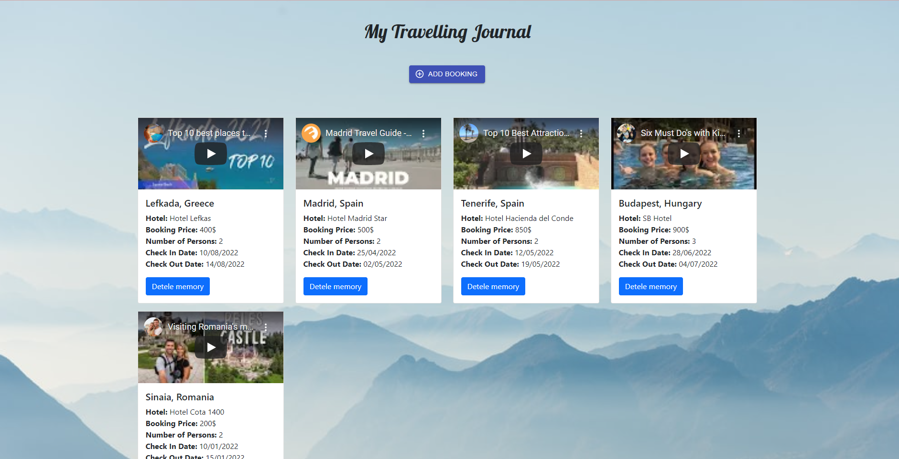
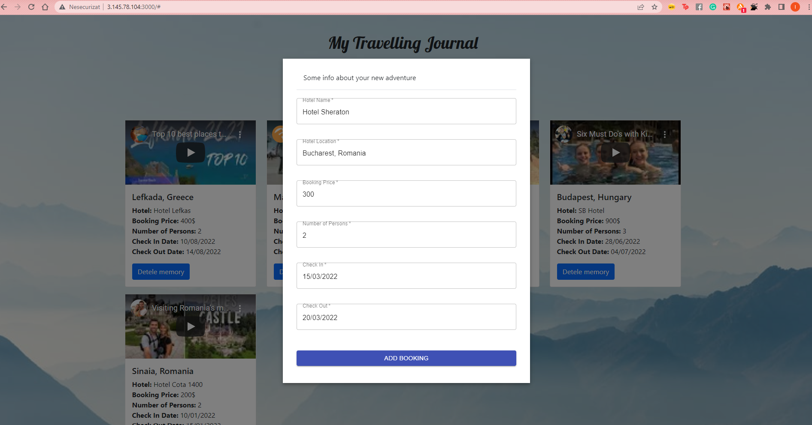

# proiect-cloud-computing
Nume: Bezea Ana-Isabel

Grupa: 1077

**Introducere și descrierea problemei**

Aplicația web propusă a fost dezvoltată cu ajutorul tehnologiilor Node JS pentru partea de back-end și React pentru front-end.  Atât stocarea datelor cât și deployment-ul sunt realizate cu ajutorul a două servicii în AWS: **RDS - MySQL** (baza de date relațională) și **EC2**. 
Aplicația oferă posibilitatea întocmirii unui jurnal de călătorie în format digital, iar fiecare memorie va fi reprezentată sub forma unui card. Utilizatorul va introduce date referitoare la o călătorie din trecut sau, bineințeles, care urmează să se întâmple, pe baza unui formular. În funcție de destinație, va fi generat în mod automat un video corespunzător. De asemenea, utilizatorul are posibilitatea de a șterge din memorii.



In figura de mai jos este reprezentat formularul de adaugare a rezervarii calatoriei



**Descriere API**

API-ul folosit este cel oferit de YouTube, disponibil gratuit la acest link, în baza unui token generat în contul de google developer: https://developers.google.com/youtube/v3. API-ul permite o funcționalitate identică cu cea a barei de search a YouTube-ului, în sensul că utilizatorul poate căuta videoclipuri după cuvinte cheie. API-ul va primi ca unul dintre parametri de căutare destinația călătoriei introdusă de utilizator în formular și va returna o listă complexă in format JSON cu rezultatele găsite, dintre care cele de interes pentru este atributul ”items”. 
În cazul nostru, aplicația va returna primul videoclip din lista de Youtube la căutarea ”atractions in” + variabila destinație. 

**Flux de date**

Rutele create pentru asigurarea comunicării dintre back-end și baza de date sunt **GET, POST și DELETE** 

```
app.get('/bookings', async(req, res)=>{
  try{
    let bookings = await Bookings.findAll();
    res.status(200).json(bookings)
  }catch(e){
    console.warn(e);
    res.status(500).json({ message: "Could not retrieve data" });

  }
})

app.post('/bookings', async(req,res)=>{
  try{
   let url = 'https://youtube.googleapis.com/youtube/v3/search?q=atractions%20in%20' + req.body.hotelLocation + '&key=**KEY**&type=video&part=snippet'
   let response = await axios.get(url)
   let first_url = "https://www.youtube.com/watch?v=" + response.data.items[0].id.videoId
   console.log(first_url)
   
    const booking = {
      hotelName: req.body.hotelName,
      hotelLocation: req.body.hotelLocation,
      bookingPrice: req.body.bookingPrice,
      numberOfPersons: req.body.numberOfPersons,
      checkIn: req.body.checkIn,
      checkOut: req.body.checkOut,
      youtubeUrl: first_url
    }
    
    await Bookings.create(booking)
    res.status(201).json({ message: "booking " + booking.hotelName + " was created" });
  }catch(e){
    console.warn(e);
    res.status(500).json({ message: "Could not create new booking" });

  } 
})


app.delete('/bookings/:hotelName', async (req,res)=>{
  try {
    let booking = await Bookings.findOne({where: {hotelName: req.params.hotelName}});
    if (booking) {
      await booking.destroy();

      res.status(200).json({ message: "booking " + req.params.hotelName + " was deleted" });
    } else {
      res.status(200).json({ message: "booking " + req.params.hotelName + " was not found" });
    }
  } catch (e) {
    console.warn(e);
    res.status(500).json({ message: "Could not delete booking record" });
  }

})
```

Baza de date conține o singură tabelă, ce conține toate datele referitoare la călătoriile utilizatorului.

Proiectul poate fi accesat la urmatorul link: http://3.23.128.76:3000/#
Iar link-ul de youtube: https://youtu.be/jL1rp_pKNBw 
